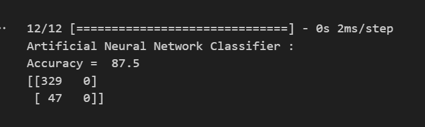

# Heart-disease-prediction

An Efficient Heart Disease Prediction System Using Machine Learning (2020)

AISC, volume 1101, pp 39-50 

• Published a research paper in "Part of the Advances in Intelligent Systems and Computing" book series. • Link: https://link.springer.com/chapter/10.1007/978-981-15-1884-3_4

Performance:
Highest accuracy with Logistic regression

Implementation of neural networks
